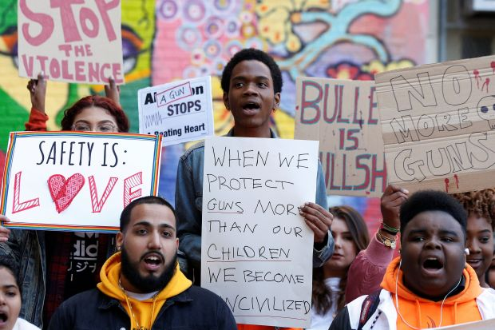

  
*Image from* [*Wall Street Journal*](https://www.wsj.com/articles/thousands-of-students-expected-to-walk-out-on-columbine-anniversary-1524216600)

Gun violence is the product of complex social factors. From our linear regression model, the mortality rate due to gun violence is best predicted by law strength, the unemployment rate, smoking and disability status. However, future gun violence policies should by no means be limited by these variables. While gun violence is a national phenomenon, it is also inextricably local and requires policies and solutions that fit in a given local context. 

We do, however, see some overarching trends form our analysis. For one, laws matter. State-level law strength in both visualizations and regression analyses proved to be associated with the mortality rate due to gun violence in a given state. This highlights that legislation is an important lever for changing gun violence in America. Another important feature of our analyses is that gun violence is not spread equally throughout the population. Certain areas seem magnetized for gun violence, but also certain populations are disproportionately affected by gun violence. Marginalized communities (e.g. Black Americans and American Indians/Alaska Natives) seem to bear the brunt of the burden, and because of this it is important to include these populations in the discussion and formation of policies. 

Ultimately, gun violence has reached every corner of America. There are growing efforts to tackle gun reform as seen by the largely attended [March For Our Lives](https://marchforourlives.com) demonstration in March of 2018. We hope that our project can be a piece of this movement and the gun reform puzzle. 
